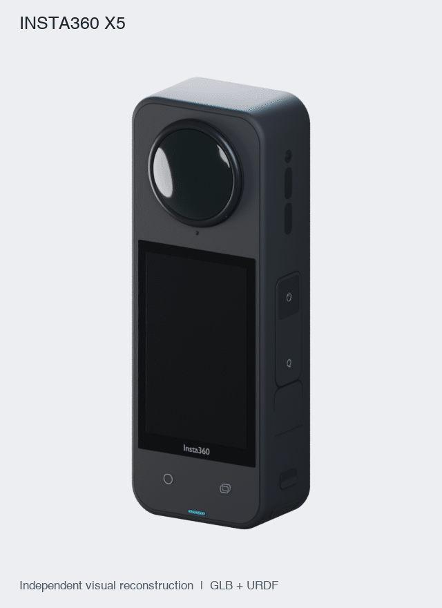
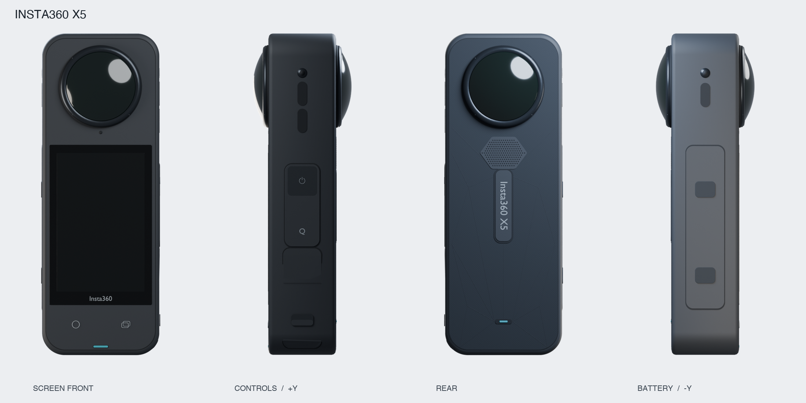
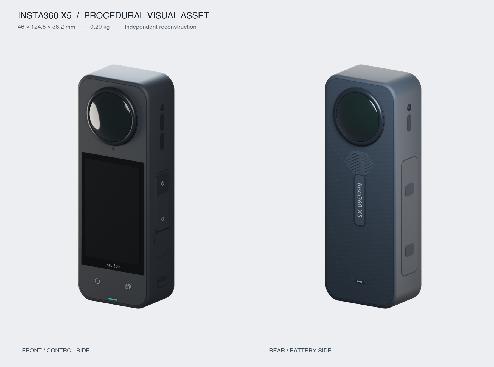
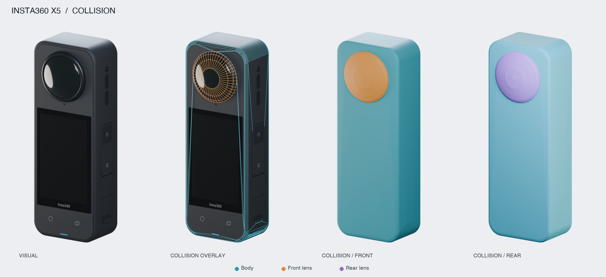

# Insta360 URDF

Insta360 camera meshes and URDFs. Currently includes **X5**; still being refined.

<p align="center">
  
</p>







*Collision: body + two lens hulls.*

## View

```bash
git clone https://github.com/TToTMooN/insta360-urdf.git
cd insta360-urdf
python -m venv .venv
source .venv/bin/activate
pip install -r requirements.txt
python scripts/viewer.py --model x5
```

Open [localhost:8080](http://127.0.0.1:8080/).

## Assets

[GLB](models/x5/assets/meshes/x5_visual.glb) · [OBJ](models/x5/assets/meshes/x5_visual.obj) · [URDF](models/x5/urdf/insta360_x5.urdf) · [Blender source](models/x5/assets/x5_source.blend)

Keep the folder layout when using the URDF. Units are meters; URDF uses Z-up with
its origin at the bottom mount. GLB uses Y-up; the viewer handles the conversion.

Independent, approximate geometry based on [official references](docs/SOURCES.md).
No calibrated imaging model. [MIT license](LICENSE); not affiliated with Insta360.
